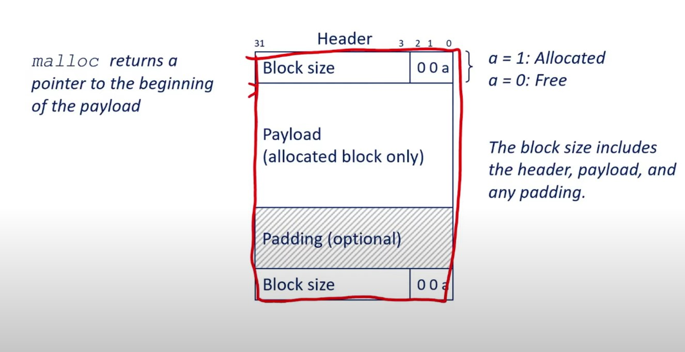

* Stack locals and .data/bss globals need to be known in advance. Heap Values/sizes dont
* Coarse Grained (OS) and Fine Grained (libc) based memory allocation

## sbrk/mmap
* sbrk is a *System Call* which asks the OS to expand/contract the size of valid memory
* mmap -> Tell the OS to allow reading/writing to a file/device as if it were in memory with byte 0 at a given address

## Allocators

### Block Headers
malloc returns a pointer to the beginning of the payload, additionally there are 4 bytes at the beginning and end to keep track of the memory block

### Where to allocate a block?
Algorithms
* First Fit
* Next Fit
* Best Fit