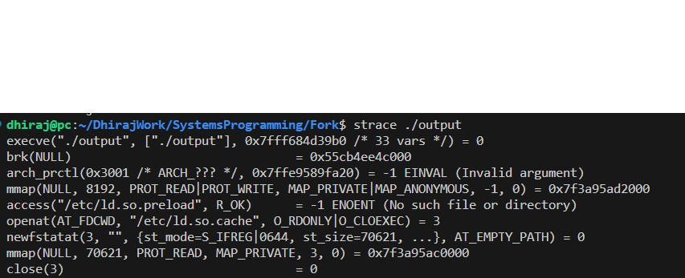

 * Proceeses have their own memory and state (register values)
 Open files, signal handlers, other stuff managed by the OS
 * The kernel manages the hardware and switching between those processes preemptively

Thread of Control = Execution Context

The shell does execv to the process that is invoked. Execv does not return. -1 if a process fails.

## Spawn
Spawn creates a new child and waits for it to finish the execution and then terminates itself.
When strace command with the output of the program is executed, the trace shows a clone statement.

## Fork
* 2 processes share the same execution context. Identical Copies.
* Share memory layout

After forking, the OS decides which process to run next

