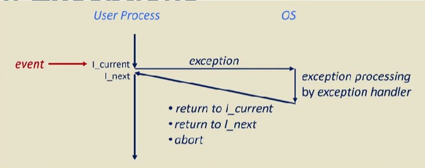

Why are Signals needed?
* IOC for process control between processes
* Interrupt-driven, rather than explicit
    * uncommon, unexpected things
* Concurrent Programming

### Examples of Signals
* SIGINT
* SIGILL
* SIGKILL
* SIGSEGV
* SIGCHILD

### Sending Signals
* Kernel sends signals by setting a flag in the process's context
* There can be multiple pending signals which a process has been sent but not yet received

### Receving Signals
* At some point, the prcess switches into kernel mode(system call, context switch, etc)
* When the process switches back to user mode, the kernel checks for pending signals
* Kernel forces the process to recive any pending signals
